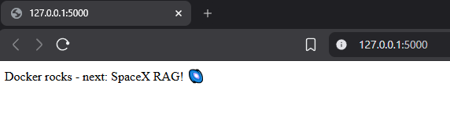

# Toy Dockerized Flask App with Tests

[](https://www.python.org/)
[](https://www.docker.com/)

A minimal "Hello World" Flask web app, fully Dockerized and tested with pytest. Demonstrates production basics: containerization, automated tests, and clean imports.

*Browser view at localhost:5000 + green pytest output.*




## Features
- Simple Flask endpoint: Returns "Docker rocks - next: SpaceX RAG! 🌌".
- Docker build/run with integrated tests (runs pytest during build).
- Pytest suite: Covers status codes, content, and emojis (Unicode-safe).
- pyproject.toml config: No import hacks - `from main import app` works everywhere.

## Quick Start

### Local Run
```bash
pip install -r requirements.txt
python main.py

Visit http://localhost:5000.
